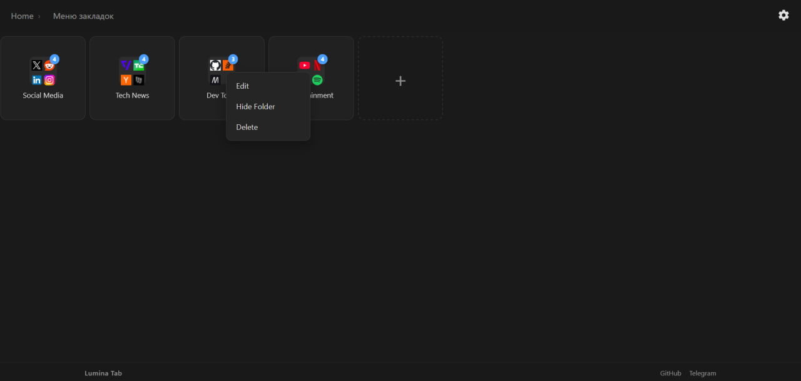
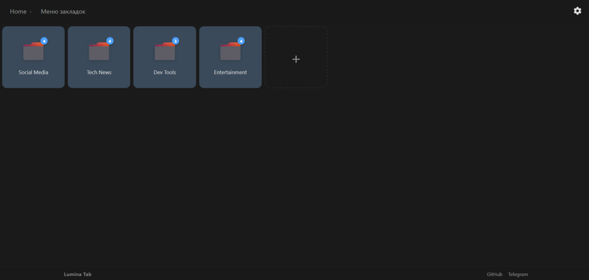
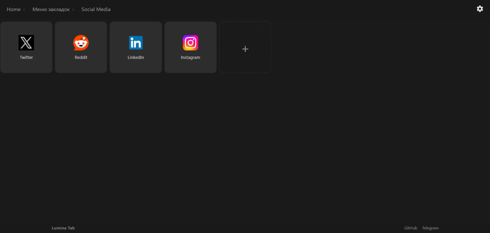
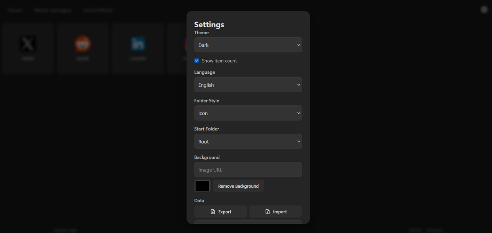

[Русская версия → README_RUS.md](./README_RUS.md)

# Lumina Tab

Lumina Tab is a clean, customizable, and fast New Tab extension for Firefox that organizes your bookmarks into grid with folder

---

## Installation

### 1. Temporary (Development)

1. Open Firefox  
2. Go to `about:debugging#/runtime/this-firefox`  
3. Click **“Load Temporary Add-on…”**  
4. Select `manifest.json` from the extension directory.

### 2. From Firefox Add-ons

Install from the official store:  
will add later
